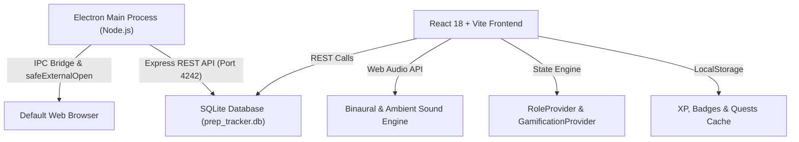

# ⚡ PrepTracker: Jarvis-Class Career Mastery & Engineering Ecosystem

> **Master DSA, System Design, AI/ML Pipelines & Senior Engineer Trade-offs — Powered by Habit Gamification, Neural Focus Audio, and Live Market Intelligence.**

[](https://opensource.org/licenses/MIT)
[]()
[](https://www.electronjs.org/)
[](https://react.dev/)
[](https://www.sqlite.org/)

---

## 🌟 The Problem PrepTracker Solves
Preparing for Tier-1 Tech (Google, Meta, OpenAI, Anthropic, Stripe, Amazon) usually means juggling 10 different tabs: LeetCode, NeetCode, YouTube tutorials, System Design blogs, tech news, and Pomodoro timers. Most engineers drop off due to lack of consistency, overwhelming topic lists, and disconnected tools.

**PrepTracker unifies the entire career preparation pipeline into an offline-first, cybernetic desktop application.**

---

## 🚀 Key Features

### 1. 🛡️ Iron Man / JARVIS Gamification Engine
- **XP Progression System**: Earn XP for every mastered topic (+100 XP), solved LeetCode problem (+100 XP), deep work session (+75 XP), and interview script review (+50 XP).
- **Suit Evolution Tiers**:
  - `Mark I (Apprentice)` — Lv 1-5
  - `Mark VII (Associate Engineer)` — Lv 6-14
  - `Mark XLII (Senior Engineer)` — Lv 15-29
  - `Mark LXXXV (Staff Architect)` — Lv 30-49
  - `JARVIS Protocol (Principal Master)` — Lv 50+
- **Daily Protocol Quests**: Daily 24-hour objectives with instant claimable rewards.
- **Hall of Achievements**: 8 unlockable badges ranging from *First Blood* to *Streak Immortal*.

### 2. 🧘 Deep Work Studio & Neural Soundscapes
- **Arc-Reactor Circular Pomodoro**: 25m Focus Flow & 5m Recharge modes.
- **Web Audio API Native Soundscapes**:
  - `🧠 40Hz Gamma Wave`: Binaural beat tuned for intense cognitive concentration.
  - `🚀 Deep Space Engine`: Low-frequency rumble for masking distractions.
  - `🌧️ Cyber Warm Rain`: Pink/brown noise synthesis for calm flow states.

### 3. 🗺️ Multi-Language Roadmap & Full-Screen Studio
- **Role-Specific Tracks**: AI Engineer, Machine Learning Engineer, Software Developer, Mobile App Developer, Cloud/DevOps Architect.
- **5-Language Synchronized Solutions**: Switch seamlessly between **Python, Java, C++, C, and JavaScript** for every single DSA topic.
- **Full-Screen Focus Mode (`⛶`)**: Expand the study canvas to eliminate all visual distractions.
- **Interactive Step-by-Step Traces**: Visual pointer tracking and state mutation tables for canonical interview problems (e.g. *Two Sum*, *Valid Anagram*, *Reverse Linked List*).
- **Embedded Curated Video Lessons**: High-yield YouTube lectures from NeetCode, Striver, freeCodeCamp, and Tech With Tim.

### 4. ⚡ Unified Practice Arena (NeetCode 150 + Striver SDE + Blind 75)
- Search across 30+ canonical problems by sheet, difficulty, topic, and **FAANG company tags** (Google, Meta, Apple, Amazon, Uber).
- 1-click external solver launch delegating directly to your default browser.
- Local persistent progress tracking with real-time completion percentages.

### 5. 📡 Live Tech Radar & 2026 Market Intelligence
- **AI & LLM Frontier**: DeepSeek V3/R1 architecture, MoE routing, LangGraph multi-agent loops, vLLM PagedAttention, and ColBERT/Hybrid RAG.
- **High-Performance Systems**: Rust async backends (Tokio/Axum), Kafka/Redpanda distributed logs, DuckDB in-process OLAP, and eBPF kernel tracing.
- **2026 Hiring Playbook**: Pattern-based DSA recognition, HLD/LLD convergence, and AI collaboration assessments.

### 6. 🧠 Staff Engineer Mindset & 60-Second Interview Power Scripts
- **Architectural Trade-Off Matrices**: First-principles frameworks for CAP/PACELC, Polyglot Persistence (SQL vs NoSQL vs NewSQL), Cache-Aside vs Write-Behind, and Modular Monoliths vs Microservices.
- **Word-for-Word Speaking Scripts**: 1-click copyable executive scripts for STAR behavioral questions, database scaling, and technical conflict resolution.

---

## 🏗️ Architecture & Tech Stack



- **Frontend**: React 18, React Router v6, Lucide Icons, Pure Vanilla CSS (Cyber-Linear Design System).
- **Desktop Wrapper**: Electron 28 with secure context isolation and custom Windows frameless TitleBar.
- **Audio Engine**: Web Audio API (zero external sound asset dependencies).
- **Backend**: Express.js with `better-sqlite3` database engine.

---

## 📦 Installation & Setup

### Prerequisites
- [Node.js](https://nodejs.org/) (v18.0.0 or higher)
- `npm` or `yarn`

### 1. Clone the repository
```bash
git clone https://github.com/Aayush-pixel29/Prep-Tracker.git
cd Prep-Tracker/prep-tracker
```

### 2. Install dependencies
```bash
npm install
```

### 3. Run in Development Mode
```bash
npm run dev
```

### 4. Build Production Desktop Installer (.exe)
```bash
npm run build
```
The compiled installer will be located in `dist-electron/PrepTracker Setup 1.0.0.exe`.

---

## 🎮 Keyboard Shortcuts & Pro Tips
- `⛶ Full Screen`: Toggle in any topic detail view to maximize reading space.
- `🔄 Switch Role`: Switch between AI Engineer, Software Dev, and Mobile Dev anytime from the sidebar.
- `🧘 Deep Work`: Engage 25m Pomodoro with 40Hz Gamma wave for maximum dopamine retention.

---

## 🤝 Contributing
Contributions, bug reports, and feature requests are welcome! Feel free to check the [issues page](https://github.com/Aayush-pixel29/Prep-Tracker/issues).

---

## 📄 License
This project is open-source and licensed under the [MIT License](LICENSE).
